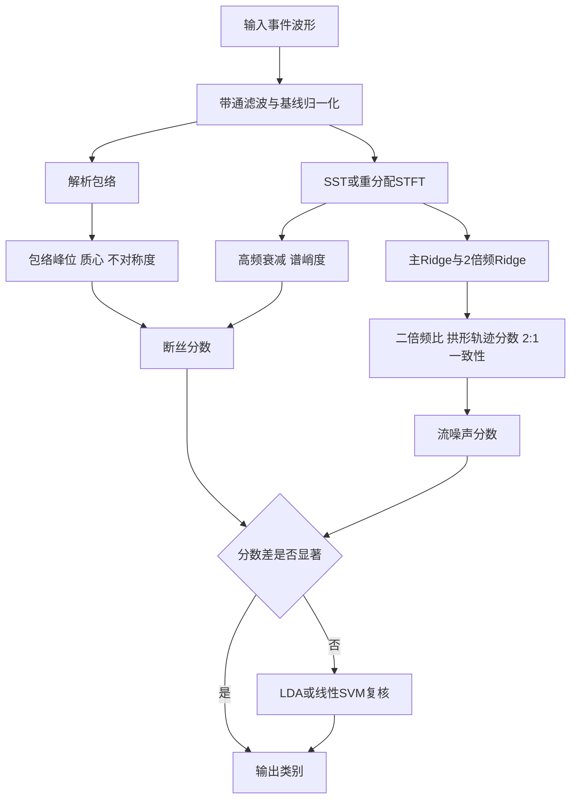

# 超短高频声学信号区分的特征分析与快速实现方案

## 执行摘要

对这两类约 0.01 s 的高频声学事件，**最不应作为主判据的是“静态频带覆盖”**，因为两类信号在 5–40/60 kHz 上明显重叠；**最应优先量化的是“动态结构差异”**：一类是断丝这类**瞬态、早峰值、后续快速衰减**的事件，另一类是流噪声这类**具有谐波组织、基频轨迹、包络对称性**的事件。已有 PCCP 断丝监测研究表明，断丝属于内部能量释放引起的短时声学事件，单靠幅值、持续时间、短时能量、短时过零率等时域特征就已经能与噪声拉开差异；而流致噪声在频域常同时含有宽带成分与离散成分，其离散部分往往表现为主频及其谐波，并与涡脱落、锁定等流体动力学机制有关。谱峭度适于抓瞬态，循环平稳特征适于抓隐藏周期性，SST/GLCT/TKEO/HHT 适于抓短时 AM–FM 与瞬时频率轨迹。

如果目标是**尽快落地、先把两类信号区分开**，最推荐先试的不是一大堆变换，而是一组**五到八维、物理意义清楚、计算量很低**的特征组合：**包络不对称度、能量质心位置、二倍频比、基频“先增后减”拱形轨迹分数、高频能量衰减斜率、谱峭度峰值**。其中，前两项抓“先粗后细”与“中间鼓包”的包络差异；中间两项抓流噪声最关键的“二倍频 + 基频变轨”；最后两项抓断丝事件的“高频快速衰减 + 强瞬态性”。这组特征比单独做 FFT 带能量、单独做小波包能量，针对性更强。

若必须只保留一组核心组合，我建议先用下面这组作为默认向量：

$$
\mathbf{z}
=
\left[
A_{\text{env}},\; C_E,\; \beta_H,\; R_{2:1},\; S_{\text{arch}},\; \epsilon_{2:1},\; SK_{\max}
\right]
$$

其中 $A_{\text{env}}$ 表示包络不对称度，$C_E$ 表示能量质心位置，$\beta_H$ 表示高频能量衰减斜率，$R_{2:1}$ 表示二倍频比，$S_{\text{arch}}$ 表示基频拱形轨迹分数，$\epsilon_{2:1}$ 表示 $2f_0$ 一致性误差，$SK_{\max}$ 表示谱峭度峰值。**这组特征本质上把“瞬态衰减”和“谐波轨迹”放到同一个判别器里**，对你的问题最对症。

## 问题定义与约束

按你给定的信息，问题可定义为：在**单通道、超短时长、频带重叠**的高频声学事件中，区分**结构损伤信号**与**流噪声信号**。其中，损伤信号的已知先验是：包络偏三角形、峰值偏前、高频能量衰减快、频带约 5–40 kHz；流噪声的先验是：包络偏鼓包、存在明显二倍频、基频随时间整体先升后降、频带约 5–60 kHz，且不同样本的基频轨迹和持续时间会变化。这意味着：**持续时间、总带宽、总能量这类静态特征可以保留，但不应成为主特征**，因为它们与工况、传播路径、放大倍数、局部噪声底都强耦合。这个判断与 PCCP 断丝监测研究中的经验是一致的：文献一方面说明波形级短时描述（幅值、持续时间、短时能量等）有用，另一方面也说明把断丝与运行管道噪声直接转为时频图进行识别是可行的。

在未指定项上，下面这些假设足以让方案继续推进，而不需要你先补更多数据。第一，采样率至少高于 120 kHz，工程上更建议 200–250 kHz 或更高，否则 60 kHz 上沿附近会被抗混叠与传感器响应扭曲。第二，事件已经被大致截取出来，至少包含少量前导静噪段和完整尾部。第三，传感器与前端在两类事件上的传递函数近似固定。第四，不存在严重削顶或自动增益控制导致的包络畸变；若存在，则应降低对峰值、峭度和 crest factor 的依赖，转而强化轨迹与谐波结构特征。以上假设并不苛刻，而且与 AE/PCCP 监测文献中常见的事件级处理方式相符。

一个很重要的工程边界是：**你的两类信号都很短**。这会直接影响特征选择。像全局功率谱、长窗 cepstrum、传统 bicoherence 这类依赖较长平稳记录的方法，不能直接拿来当一线特征；而**短窗 STFT/SST、重分配谱、TKEO、包络几何、Ridge 轨迹**这类方法更合适。特别是对短时振荡瞬态，重分配谱与多窗重分配谱在能量聚焦与低 SNR 鲁棒性上是有文献支持的。

## 候选特征与物理依据

下面的特征清单，不按“时域/频域/小波”教科书分类，而按**物理可分性**分类。这样更适合你的问题，因为你真正想抓的不是“某个变换”，而是“断丝瞬态”和“流噪声谐波调制”之间的机制差异。AE 领域长期使用 rise time、duration、counts、RA、AF 等参数描述瞬态波形；瞬态检测常用谱峭度；隐藏周期性与调制常用循环平稳谱相关/谱相干；非平稳 AM–FM/IF 的提取则常用 SST、HHT、GLCT 与 TKEO；当样本少而结构复杂时，散射变换与稀疏时频分解则是可解释又稳健的后备方案。

表中的“预期区分能力”“噪声敏感性”等列，是结合你给出的信号形态与相关文献方法后形成的**工程综合判断**，不是某篇论文中的固定数值。

| 特征名 | 计算公式或步骤 | 预期区分能力 | 计算成本 | 对噪声敏感性 |
|---|---|---:|---:|---:|
| 包络峰位比 $r_p$ 与能量质心 $C_E$ | 先取解析包络 $a(t)=\lvert x(t)+j\mathcal{H}\{x(t)\}\rvert$。记事件起止为 $t_{on}, t_{off}$，峰值时刻为 $t_p$。令 $r_p=\frac{t_p-t_{on}}{t_{off}-t_{on}}$，$C_E=\frac{\sum_t t\,a^2(t)}{\sum_t a^2(t)}$ | 高 | 低 | 低到中 |
| 包络不对称度 $A_{\text{env}}$ | $A_{\text{env}}=\frac{(t_{off}-t_p)-(t_p-t_{on})}{t_{off}-t_{on}}$。断丝倾向 $>0$，流噪声倾向 $<0$ 或接近 0 | 高 | 低 | 低到中 |
| 高频衰减斜率 $\beta_H$ | 在时频图上取高频带 $E_H(t)=\sum_{f\in[30,60]\,\text{kHz}}S(t,f)$，对峰后段拟合 $\log(E_H(t)+\epsilon)$ 对 $t$ 的斜率 | 高 | 中 | 中 |
| 二倍频比 $R_{2:1}$ | 提取主 Ridge $f_1(t)$，计算 $R_{2:1}=\frac{\sum_t E(t,2f_1(t)\pm \Delta f)}{\sum_t E(t,f_1(t)\pm \Delta f)+\epsilon}$ | 很高 | 中 | 中 |
| 谐波栈能量比 $H_{\text{stack}}$ | $H_{\text{stack}}=\frac{\sum_t\sum_{m=1}^{M}E(t,mf_1(t)\pm \Delta f)}{\sum_{t,f}S(t,f)}$，一般 $M=2$ 或 3 即可 | 高 | 中 | 中 |
| 拱形轨迹分数 $S_{\text{arch}}$ | 对 $f_1(t)$ 做二次拟合 $q(t)=at^2+bt+c$，令 $S_{\text{arch}}=R^2(f_1,q)\cdot \mathbf{1}(a<0)\cdot \mathbf{1}(t_v\in[0.2T,0.8T])$ | 很高 | 中 | 中 |
| 二倍频一致性误差 $\epsilon_{2:1}$ | 若存在第二 Ridge $f_2(t)$，算 $\epsilon_{2:1}=\mathrm{median}_t\left\lvert\frac{f_2(t)}{2f_1(t)}-1\right\rvert$ | 很高 | 中 | 中 |
| 谱峭度峰值 $SK_{\max}$ | STFT 后对每个频点 $k$ 算 $\hat{SK}(k)=\frac{\langle \lvert X_m(k)\rvert^4\rangle}{\langle \lvert X_m(k)\rvert^2\rangle^2}-2$，取最大值或高频带平均 | 中到高 | 中 | 中到低 |
| 频谱平坦度 $SF$ 或时频 Renyi 熵 $H_\alpha$ | $SF=\frac{\exp\!\left(\frac{1}{K}\sum\ln P_k\right)}{\frac{1}{K}\sum P_k}$；或对归一化时频图计算 $H_\alpha=\frac{1}{1-\alpha}\log\sum p_{tf}^\alpha$ | 中 | 低到中 | 中 |
| TKEO 瞬时频率稳定度 | 先窄带滤波，再算 $\Psi[x_n]=x_n^2-x_{n-1}x_{n+1}$，从中估计瞬时幅频，并统计 IF 方差或平滑残差 | 中到高 | 很低 | 中 |
| Chirplet/GLCT 拟合残差 | 用 chirplet 或 GLCT 对事件做稀疏拟合，比较“单一调频双谐波模型”的残差与“阻尼冲击模型”的残差 | 高 | 中到高 | 低到中 |
| 双谱/双相干 $b^2(f_0,f_0)$ | 检查 $(f_0,f_0)\rightarrow 2f_0$ 的二次相位耦合；适合作为离线佐证，不宜做一线在线特征 | 中到高 | 高 | 对短记录敏感 |

为避免后续实现时对符号理解不一致，这里把上表中最容易歧义的量统一说明如下。$S(t,f)$ 表示时频能量图或谱图强度，若用 STFT，则可取 $S(t,f)=|X(t,f)|^2$；$E(t,f_1(t)\pm\Delta f)$ 表示以 ridge 频率为中心、半带宽为 $\Delta f$ 的邻域积分能量。$\Delta f$ 不是固定常数，而是 ridge 邻域宽度，工程上建议取频率分辨率的 2 个 bin 与 $0.08f_1(t)$ 两者中的较大者。$T$ 表示事件有效持续时间，$t_v$ 表示二次拟合曲线 $q(t)=at^2+bt+c$ 的顶点时刻，因此 $S_{\text{arch}}$ 中的 $\mathbf{1}(t_v\in[0.2T,0.8T])$ 用来限制“拱顶”不能落在事件两端。$\epsilon$ 表示防止分母为零或对数奇异的小正数，不是物理噪声项。$\hat{SK}(k)$ 中的 $X_m(k)$ 表示第 $m$ 帧在第 $k$ 个频点的 STFT 系数，$\langle\cdot\rangle$ 表示对时间帧求平均。$p_{tf}$ 表示归一化后的时频能量分布，因此 $H_\alpha$ 度量的是“能量在时频平面上有多分散”。TKEO-IF 稳定度中的 IF 指瞬时频率，实际落地时建议取候选窄带分量的瞬时频率方差或一阶差分均方作为该特征。

**为什么这些特征能区分两类信号。**
对断丝信号，最强的物理直觉是“**突发释放**”。PCCP 断丝监测文献直接把断丝描述为与内部能量释放有关的短时事件，并且证明仅用短时能量、短时过零率、持续时间等时域统计就能与噪声分开；AE 文献也一直把 rise time、duration、counts、RA、AF 这些参数当作瞬态源表征的核心。换到你的场景里，就自然落到“峰值偏前、尾部拖尾、高频衰减快、谱峭度高”这组特征上。

对流噪声信号，最强的物理直觉是“**受流体动力学相干结构约束的时变周期**”。流致噪声文献指出，这类噪声在频域常表现为**宽带成分 + 离散成分**并存，离散部分往往是主频及其谐波；流声与涡脱落相关时，特征频率又受 Strouhal 关系与锁定效应影响，随速度或耦合状态变化而变化。你观察到的“二倍频明显、基频先增大后减小”，与这类机制完全一致，所以**谐波比、2:1 一致性、拱形轨迹分数、循环平稳谱相干**应是流噪声类别的主特征。

**适合做 Ridge 与 IF 提取的方法。**
SST 通过对 CWT 结果做再分配来压缩时频能量，PCCP 断丝动态图谱已有工作就直接使用了 synchrosqueezed wavelet transform；HHT/EMD 则适合非线性、非平稳信号并以 IMFs 的瞬时频率工作；GLCT 通过 chirp-rate 参数显式增强对非线性 IF 的聚焦与重构；TKEO 则以非常低的复杂度估计 AM–FM 信号的瞬时幅频。对你的问题，**先用 SST 或重分配 STFT 做 主/二倍频 Ridge 提取**，如果流噪声的 $f_0(t)$ 非常弯曲，再切换到 GLCT；如果追求实时性，则在窄带分量上用 TKEO。

**辅助但值得保留的高级特征。**
谱峭度的理论用途，就是在频域定位和识别瞬态；Renyi 熵用于量化时频图的“复杂度/集中度”；散射变换的优势是平移不变、对小形变稳定，同时仍保留高频与高阶信息；联合时频散射对**频率调制激励**表征尤其合适；matching pursuit 则能给出自适应、无交叉项的时频稀疏分解。它们都适合作为“第一版规则系统做完以后”的增强选项。双谱/双相干可以检查 $f_0+f_0\to2f_0$ 的二次耦合，但对你的超短记录不能盲信，必须配合显著性检验或 surrogate test，因为经典 bicoherence 在**短记录、强非平稳、快变包络**时容易出假阳性。

## 特征组合与判别逻辑

最快可落地的组合，不是“所有特征一起上”，而是做一个**两条证据链并行**的判别器：
一条证据链专门抓**断丝的瞬态衰减**，另一条证据链专门抓**流噪声的谐波轨迹**。这样做的好处是，两个子分数来自两种不同物理机制，互相补偿，不容易一起失效。

我建议把判别写成两个分数：

$$
L_{\text{damage}}
=
z(A_{\text{env}})
+
z(0.5-C_E)
+
z(-\beta_H)
+
z(SK_{\max})
$$

$$
L_{\text{flow}}
=
z(R_{2:1})
+
z(H_{\text{stack}})
+
z(S_{\text{arch}})
-
z(\epsilon_{2:1})
$$

其中 $z(\cdot)$ 表示用运行中位数与 MAD 做的稳健标准化。然后先比较 $L_{\text{damage}}$ 与 $L_{\text{flow}}$。如果 $L_{\text{flow}}-L_{\text{damage}}$ 足够大，就判流噪声；反之判断丝；中间灰区再进入一个轻量二级判别器，比如 LDA 或线性 SVM。这类线性模型在样本很少时通常比复杂核方法更稳，也更便于回看每个特征的贡献；若以后希望用更少样本但更强的表征，可以把散射系数接到线性分类器或 Gaussian-kernel SVM 上。

这里再补一层计算口径。$z(s)$ 建议按 $z(s)=(s-\mathrm{median}(s))/(1.4826\,\mathrm{MAD}(s)+\epsilon)$ 计算，其中 MAD 为 median absolute deviation，用于在少样本和异常值存在时保持稳定。式中的 $0.5-C_E$ 并不是新的物理量，而是把“能量质心越靠前越像断丝”这一趋势统一改写成“数值越大越偏向损伤”的评分方向；相应地，$-\beta_H$ 表示高频衰减越快，损伤评分越高。

阈值不要一上来就拍脑袋给绝对值，而应按下面的逻辑设。若暂时没有标注数据，可以先对 $A_{\text{env}}$、$R_{2:1}$、$S_{\text{arch}}$ 这三个最有物理解释的特征做单变量直方图，尝试 Otsu 或双高斯分裂，看阈值是否稳定。若有极少量种子样本，优先用 ROC 的 Youden 指数定单特征阈值，再把特征组合交给 LDA。若以后有少量真实样本，可以用 Mann–Whitney U、单特征 AUC、Fisher score 或 Cliff’s delta 给特征排序，只保留前五到前八个最稳特征；**不要把高相关、重复表达同一物理量的特征全部堆进去**。例如 $r_p$、$C_E$、$A_{\text{env}}$ 本质都在描述包络几何，只保留其中两项通常就够。

一个实用的规则版逻辑可以写成下面这样。它不是最终模型，但非常适合作为第一版 baseline，因为几乎所有环节都可解释、可视化、可手工诊断。



如果只允许做**一个最小可行系统**，我建议优先顺序是：
第一优先：$(A_{\text{env}}, C_E, R_{2:1}, S_{\text{arch}}, \beta_H)$。
第二优先：$\epsilon_{2:1}, SK_{\max}, H_{\text{stack}}$。
第三优先：$SF/H_\alpha$、TKEO-IF 稳定度、chirplet/GLCT 残差。
第四优先：双谱/双相干、散射特征。
这样排的原因很简单：前两层已经紧扣你给出的“包络”“二倍频”“基频变轨”“高频衰减”四个最关键现象。

## 快速实现与计算复杂度

先说实现路线。对你的任务，第一版系统完全没必要上深度网络。PCCP 文献确实已经把断丝与运行噪声转成 SWT 时频图，再用目标检测或卷积网络做识别；但如果当前目标是**尽快做出可解释的特征方案**，手工特征 + 轻量分类器明显更快，也更容易查错。

我建议的默认处理流程如下。先做 **5–70 kHz** 带通，再用前导静噪段做稳健归一化。随后用解析包络或 TKEO 找到事件起止；为了可比性，把所有事件峰值对齐，并保留固定长度前导段。时频图先从**重分配 STFT**或**SST**开始，不必一开始就上 GLCT；如果发现流噪声的 Ridge 明显弯曲、用 SST 仍然发散，再切到 GLCT。对极短、低 SNR、振荡型瞬态，多窗重分配谱（MTRS）在文献中被专门设计出来解决“单窗重分配对噪声敏感”的问题，因此它非常适合做你后续的增强版本。

参数上，若采样率约 200–250 kHz，STFT 或重分配谱的窗长可以先取 **128–256 点**，相当于约 **0.5–1.0 ms**；这种设置既够抓 5–30 kHz 主脊，又不会把 0.01 s 的事件切得太粗。若采样率不同，不要机械照搬“点数”，而要按“**窗内包含约 5–10 个候选主频周期**”来缩放。主 Ridge 搜索带建议先限在 **5–30 kHz**，第二 Ridge 只在 $2f_1(t)$ 附近搜索。高频衰减可先用 **30–60 kHz**，如果你的传感器在 40 kHz 以上明显滚降，再把高频带改成 **25–45 kHz** 或按实测响应重设。

下面这张复杂度表足够指导工程实现。假设单个事件长度 $N\approx 2000$ 点，已经属于非常轻量的尺度。

| 模块 | 主要运算 | 复杂度量级 | 工程评价 |
|---|---|---:|---|
| 包络、峰位、质心、不对称度 | Hilbert / 累加 | $O(N)$ 或 $O(N\log N)$ | 极轻，实时无压力 |
| TKEO 子带特征 | 差分乘法 | $O(N)$ | 极轻，适合在线 |
| 单次 FFT / Welch 特征 | FFT | $O(N\log N)$ | 很轻 |
| STFT / 重分配 STFT | 多帧 FFT | $O(MW\log W)$ | 很轻到轻 |
| SST / SWT | CWT + 重分配 | 约为 STFT 的数倍 | 轻到中 |
| Ridge 动态规划提取 | 时频网格搜索 | $O(TF)$ | 中，但仍很快 |
| GLCT / chirplet 扫描 | 多 chirp-rate 网格 | $O(G\cdot N\log N)$ | 中到高，做二线特征 |
| 谱峭度 | 基于 STFT 的矩 | $O(TF)$ | 中 |
| 双谱 / 双相干 | 三阶谱统计 | 通常高于 $O(F^2T)$ | 不宜一线在线 |
| 散射特征 | 多尺度卷积 | 中 | 可做稳健后备 |

如果用 Python/NumPy 或 MATLAB 实现，在 $N\approx 2000$ 的事件级输入上，**一线特征通常都是毫秒级到十毫秒级**；真正拉高代价的，主要是 GLCT/chirplet 扫描和双谱类特征。也就是说，**“先做一版可用系统”时完全不必担心算力，应该担心的是特征冗余与阈值不稳**。

一个足够接近代码的伪代码如下：

```text
输入: 原始事件 x[n]

1. x1 = bandpass(x, 5kHz, 70kHz)
2. x2 = robust_normalize(x1, pre_event_segment)
3. env = abs(hilbert(x2))
4. t_on, t_off, t_p = detect_event_bounds(env)
5. 计算 A_env, C_E, r_p
6. 计算时频图 S(t,f) = SST(x2) 或 reassigned_STFT(x2)
7. 提取主 ridge f1(t); 若可能，提取第二 ridge f2(t)
8. 计算 R_2:1, H_stack, S_arch, epsilon_2:1
9. 计算 beta_H, SK_max, SF 或 H_alpha
10. 形成 z = [A_env, C_E, beta_H, R_2:1, S_arch, epsilon_2:1, SK_max]
11. 先用规则分数 L_damage 与 L_flow 判别
12. 若落在灰区, 用 LDA/linear SVM 复核
输出: 类别 + 置信度 + 关键特征值
```

## 鲁棒性、验证流程与工程路线

在频带重叠和噪声存在的前提下，最重要的鲁棒性策略不是“更强的黑箱模型”，而是**尽量使用归一化后的几何与比值特征**。例如 $A_{\text{env}}$、$C_E$、$R_{2:1}$、$\epsilon_{2:1}$、$S_{\text{arch}}$ 都不依赖绝对增益，天然比总能量、峰值幅度更不怕通道增益变化。高频衰减也不要直接看某一时刻的高频能量，而应该看**峰后斜率**。若基础噪声不稳，可先做 pre-event whitening 或谱减；若主 Ridge 提取失败，则退回到 cepstrum、自相关或 TKEO 子带估计；若记录太短、包络又变化过快，则不要把双相干作为主判据，因为经典 bicoherence 在这类条件下确有假阳性风险。谱峭度与多窗重分配谱在这方面更稳。

验证流程不需要大量真实样本，先做少量**仿真 sanity check**就够。可以先合成两组模板。断丝模板可写成若干个阻尼振荡分量之和：

$$
x_d(t)\approx \sum_{m=1}^{M} A_m e^{-\alpha_m(t-t_0)}\cos\!\left(2\pi f_m(t-t_0)+\theta_m\right)u(t-t_0)
$$

流噪声模板可写成 AM–FM 双谐波模型：

$$
x_f(t)\approx \sum_{k\in\{1,2\}} a_k(t)\cos\!\left(2\pi\int_0^t f_k(\tau)\,\mathrm{d}\tau+\phi_k\right)+b(t)
$$

其中 $a(t)$ 取高斯包络、raised-cosine 包络或你看到的“鼓包”包络，基频取

$$
f_0(t)=f_c+b(t-t_m)-c(t-t_m)^2,\quad c>0.
$$

这样你可以在**不收集大量真实样本**的前提下，先检验 $A_{\text{env}}$、$R_{2:1}$、$S_{\text{arch}}$、$\beta_H$ 的方向是否稳定。只要每类做几十到一两百个参数随机化的合成样本，就足够检验特征方向与阈值稳定性。仿真时把持续时间做成 3–12 ms，SNR 扫到 -5 dB 到 20 dB，$\rho$ 扫到 0.2–1.0，Ridge 曲率做强弱变化，这样最接近你的实际不确定性。

评价指标上，第一轮不要盯住总体准确率，而要先看**单特征 ROC/AUC**，这能最快判断哪些特征真的有分离力。第二轮再看组合后的 **F1、混淆矩阵、balanced accuracy、ROC/PR 曲线**。如果真实部署里流噪声远多于断丝，那么 PR 曲线会比 ROC 更有参考价值。还应做一个简单消融：依次去掉“包络组”“谐波组”“高频衰减组”“高阶统计组”，看性能掉多少。**如果去掉谐波组后性能大幅下降，说明流噪声的二倍频与轨迹特征是你真正的主信息；如果去掉包络组后性能明显下降，说明断丝的几何瞬态性是主信息。** 这种消融非常适合工程上快速收敛。

从工程实施优先级看，我建议按下面顺序推进。**第一步**只做包络 + 高频衰减 + plain STFT，拿到 $A_{\text{env}}, C_E, \beta_H, SF$。**第二步**加入 SST 或重分配 STFT，拿到 $R_{2:1}, S_{\text{arch}}, \epsilon_{2:1}$。**第三步**用规则分数和 LDA 做一个双层判别器。**第四步**若低 SNR 或强变轨样本仍难分，再加 TKEO、GLCT 或 MTRS。**第五步**只有在前面仍不够时，才上散射特征或双谱类复核。这个顺序的好处是：前 80% 的区分力，往往来自前 20% 的实现复杂度。

继续深化时，建议优先沿这些方向检索和查阅：**PCCP wire break DAS / acoustic emission parameter analysis / spectral kurtosis / cyclostationarity spectral coherence / synchrosqueezing / Hilbert–Huang / GLCT or chirplet / Teager–Kaiser / wavelet scattering / Renyi entropy / bispectrum bicoherence**。这些方向基本覆盖了你这个问题里“瞬态衰减”“时变谐波”“少样本可解释分类”“超短记录鲁棒性”四个核心矛盾。

最终结论可以压缩成一句话：**对你的两类信号，应把“断丝的瞬态衰减”与“流噪声的二倍频 + 基频拱形轨迹”同时量化，优先用包络不对称、二倍频比、拱形轨迹分数、高频衰减斜率和谱峭度组成一个可解释的轻量判别器；这比单独依赖频带能量、单独做小波包能量更快、更稳、更贴近物理机制。**
